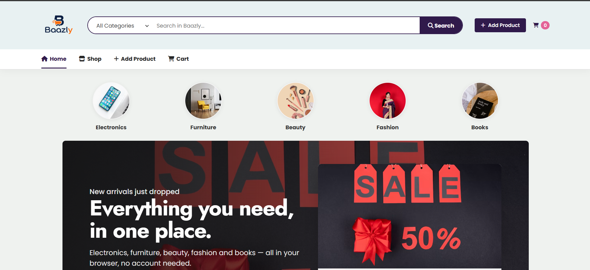
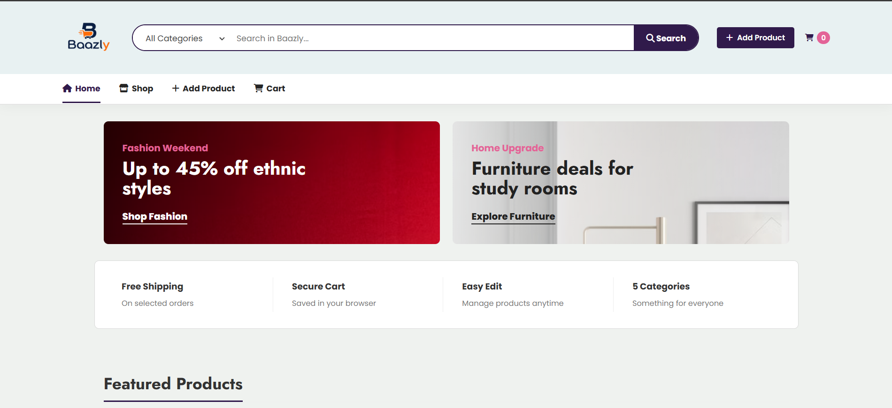
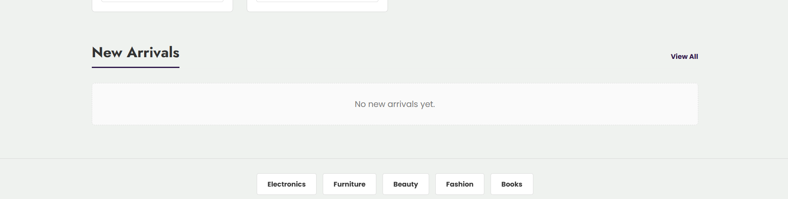
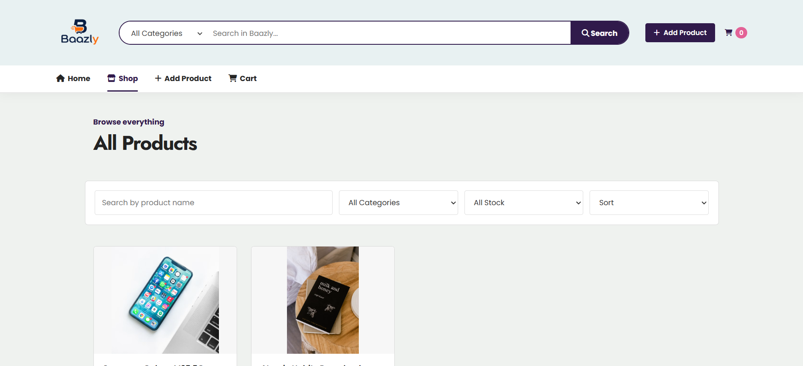
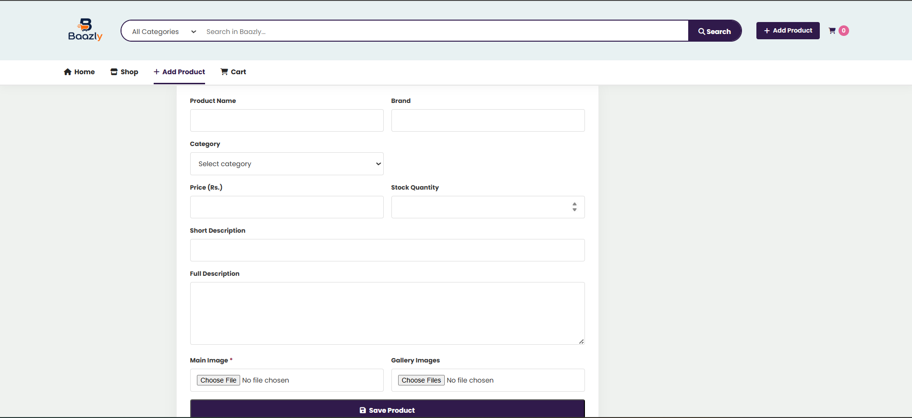
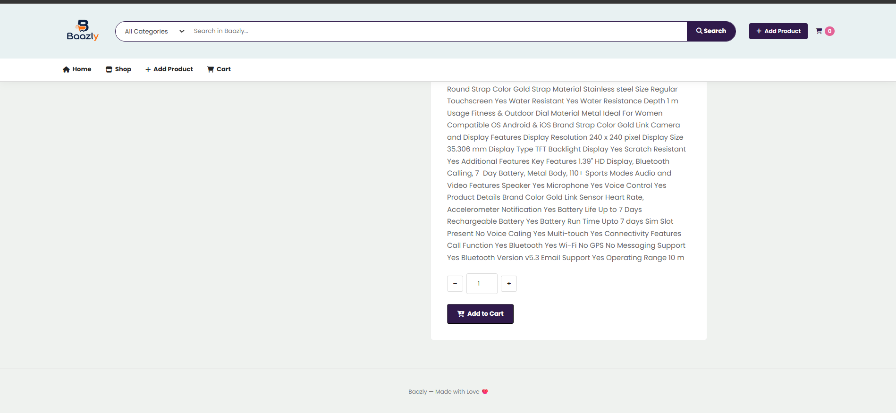
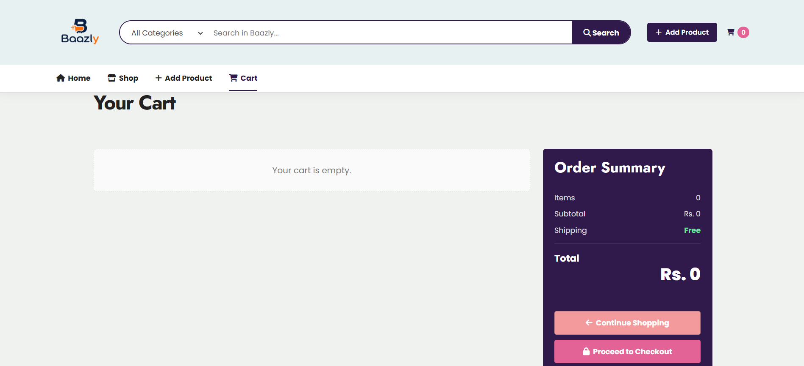
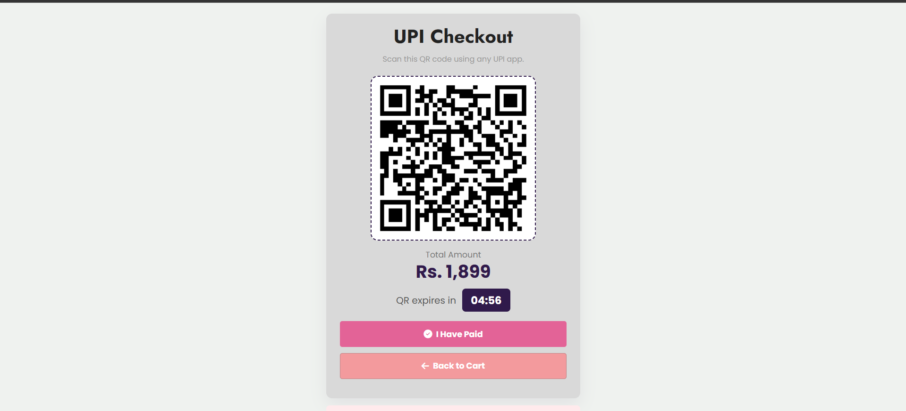

# Baazly

A modern, responsive e-commerce application built with **React.js**, **Vite**, **React Router**, and **JSON Server**. Features product browsing, category filtering, search, dynamic product management, persistent cart & wishlist, user authentication, protected routes, and order checkout with WhatsApp integration.

## Features

- **Home Page**: Hero banner, promotional grids, service highlights, category cards, and featured/new arrival products
- **Shop & Search**: Filter by category, filter by in-stock / out-of-stock, sort by price / name, real-time live search
- **Product Details**: Product image gallery with automatic cycling slideshow, detailed specifications, stock validation, and quantity selection
- **Cart Management**: Real-time cart synchronization, quantity adjustments with stock limits, and order subtotal calculations
- **Wishlist**: Toggle products to and from wishlist with toast notifications
- **Authentication**: User sign in, user registration, authenticated session persistence, and protected routes
- **Customer Profile & Orders**: Account management, delivery profile updates, and order history tracking
- **Checkout & Direct Ordering**: Pre-filled customer and delivery information with instant order generation and WhatsApp order forwarding
- **Product Administration**: Modal-based editing and direct deletion of products with JSON Server REST API synchronization

## Tech Stack

- **React 18**
- **Vite**
- **React Router v6**
- **Axios**
- **JSON Server** (REST API mock backend)
- **Vanilla CSS** (Custom responsive design system)

## How To Run

1. Install dependencies:
   ```bash
   npm install
   ```

2. Start the mock REST API backend:
   ```bash
   npm run server
   ```

3. Start the Vite React development server:
   ```bash
   npm run dev
   ```

## 📸 Screenshots











---

## 👨‍💻 Author

**Prayash Jena**
- GitHub: [@prayash1322](https://github.com/prayash1322)