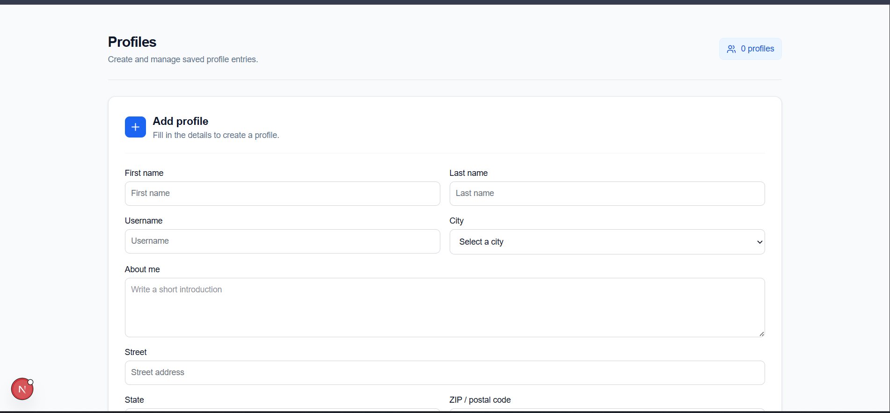
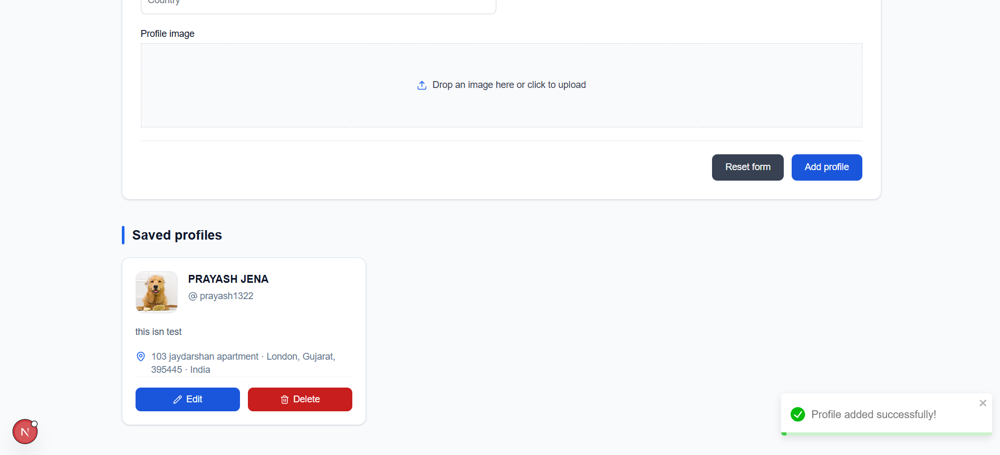
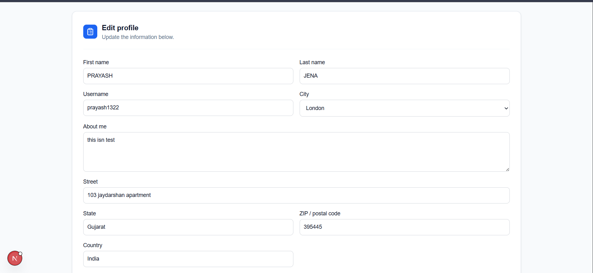
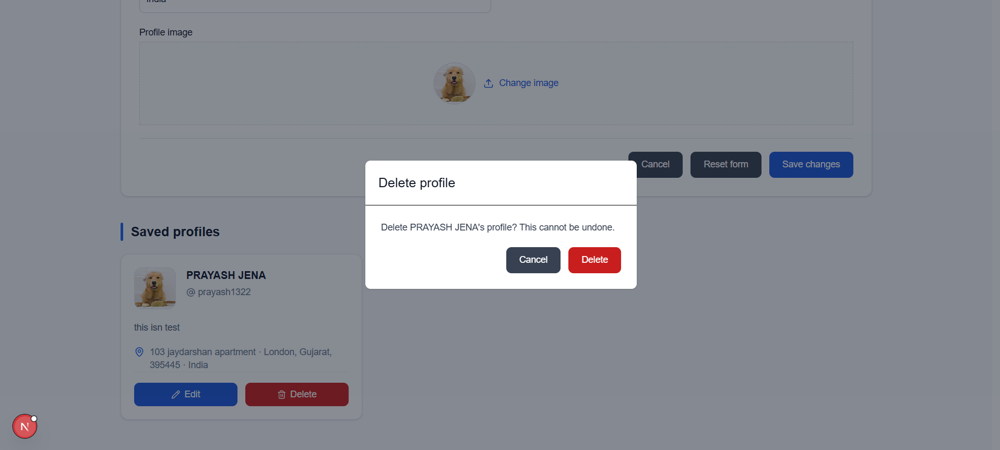

# Forms Project - Profile Management Web Application

A modern, responsive profile management web application built with **Next.js**, **TypeScript**, **Tailwind CSS**, **Flowbite React**, and **React Hook Form + Zod**.

---

## Screenshots

### 1. Profile Form


### 3. Saved Profiles


### 4. Edit & Delete



---

## Video Explanation

Watch the full walkthrough and feature overview:

> **[Watch Video Walkthrough & Code Explanation](https://drive.google.com/file/d/17jemQIn3c2hXHLUuzMP5NgbenDbTqZKL/view?usp=sharing)**

---

## Features

- **Profile Form**: Full-featured form with first name, last name, username, city dropdown, about me, address fields, and profile image upload.
- **Image Upload**: Drag-and-drop or click-to-upload profile image with live preview and file validation.
- **Form Validation**: Schema-based validation using Zod with inline error messages per field.
- **Profile Cards**: Saved profiles displayed in a responsive grid with avatar, username, about me, and address.
- **Edit & Delete**: Edit any saved profile (form pre-fills with existing data) or delete with a confirmation modal.
- **LocalStorage Persistence**: All profiles are saved to and loaded from `localStorage` — data survives page refreshes.
- **Success Toast**: On form submission, a dismissible success toast notification appears.
- **Empty State**: Friendly empty state UI when no profiles have been added yet.

---

## Tech Stack

- **Framework**: Next.js 16 (App Router)
- **Language**: TypeScript
- **Styling**: Tailwind CSS v4
- **UI Components**: Flowbite React
- **Icons**: Lucide React
- **Forms**: React Hook Form v7
- **Validation**: Zod v4
- **Image Handling**: Next.js `Image` component

---

## Getting Started

### 1. Prerequisites
- Node.js (v18 or higher recommended)
- npm or yarn

### 2. Installation
```bash
git clone <your-repo-url>
cd forms-project
npm install
```

### 3. Run Locally
```bash
npm run dev
```
Open your browser and navigate to `http://localhost:3000`.

### 4. Build for Production
```bash
npm run build
npm start
```

---

## Project Structure

```
forms-project/
├── app/
│   ├── favicon.ico
│   ├── globals.css
│   ├── layout.tsx
│   └── page.tsx
├── components/
│   ├── ImageUpload.tsx
│   ├── ProfileCard.tsx
│   └── ProfileForm.tsx
├── lib/
│   └── storage.ts
├── types/
│   └── profile.ts
├── public/
├── package.json
├── next.config.ts
├── tsconfig.json
└── tailwind.config.ts
```

---
