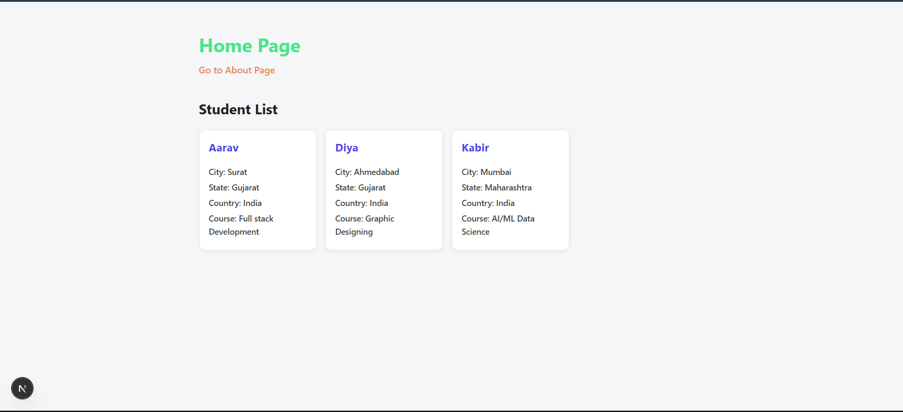
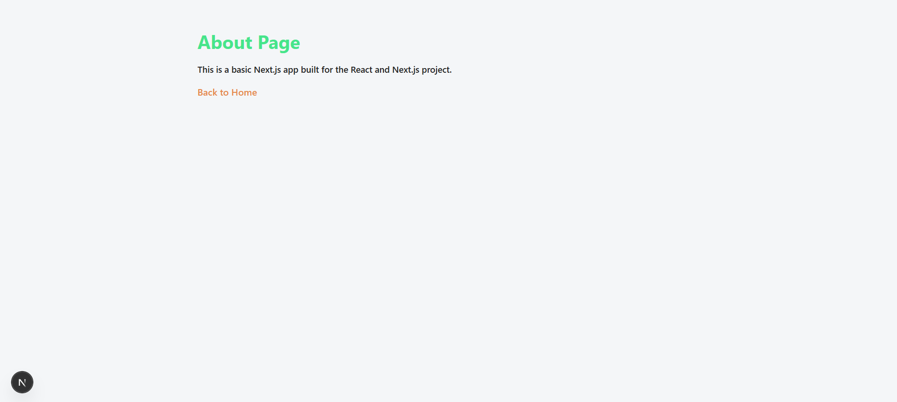

# Next-Project-1 — Next.js App Router

A Next.js learning project built during the **Full Stack Development** course at **Red & White Skill Education**. It demonstrates the Next.js App Router, file-based routing, server components, reusable components with props, and navigation using the `Link` component.

---

## Tech Stack

- Next.js 16
- React 19
- Tailwind CSS 4
- JavaScript (JSX)

---

## Features

- Home page with a list of student cards rendered from data
- About page with navigation back to home
- Reusable `StudentCard` component using props
- Client-side navigation with `next/link`
- App Router with file-based routing (`/` and `/about`)

---

## Project Structure

```
next-project-1/
├── public/
├── src/
│   └── app/
│       ├── about/
│       │   └── page.js
│       ├── components/
│       │   └── StudentCard.js
│       ├── globals.css
│       ├── layout.js
│       └── page.js
├── next.config.mjs
├── package.json
└── postcss.config.mjs
```

---

## Pages

| Route | Description |
|-------|-------------|
| `/` | Home page — displays student card list |
| `/about` | About page — project description |

---

## Getting Started

```bash
# Install dependencies
npm install

# Start development server
npm run dev
```

App runs at `http://localhost:3000`

---

## Screenshots

> Add screenshots of your app here.

| Home Page | About Page |
|-----------|------------|
|  |  |

---

## Video Explanation

> Add a link to your video walkthrough here.

[](https://drive.google.com/file/d/1J4bmZVBlQBDMzU4LReXabVqNbKxhDDv1/view?usp=sharing)

---

## Author

**Prayash**
Course: Full Stack Development
Institute: Red & White Skill Education
