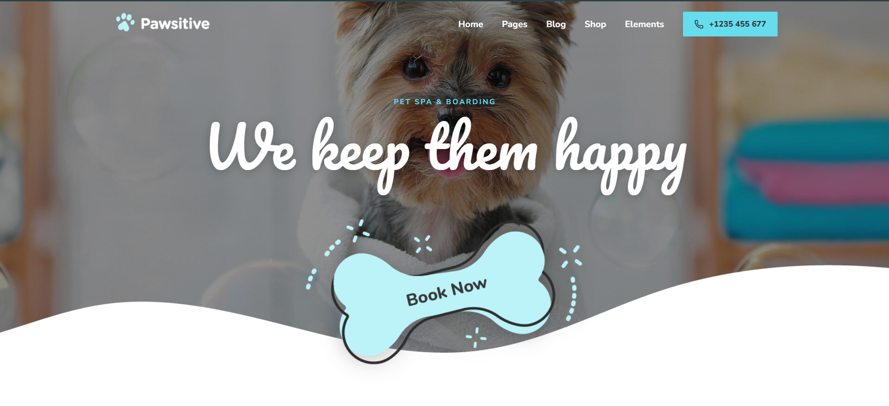
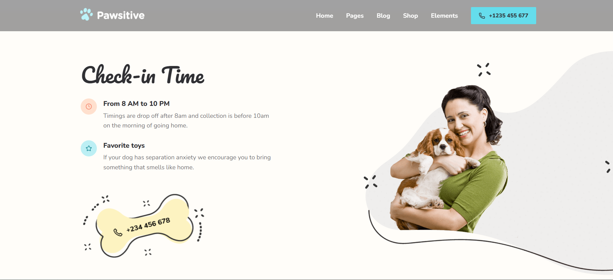
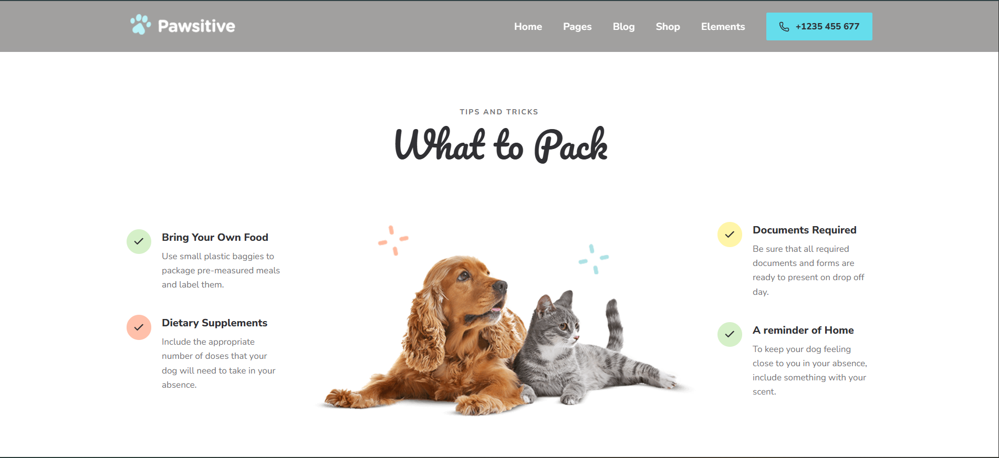
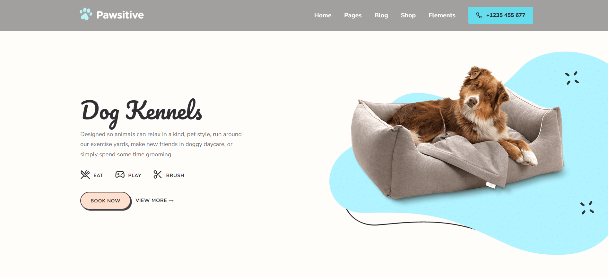
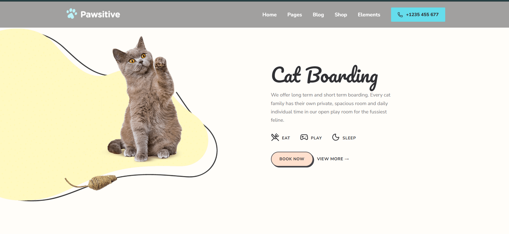
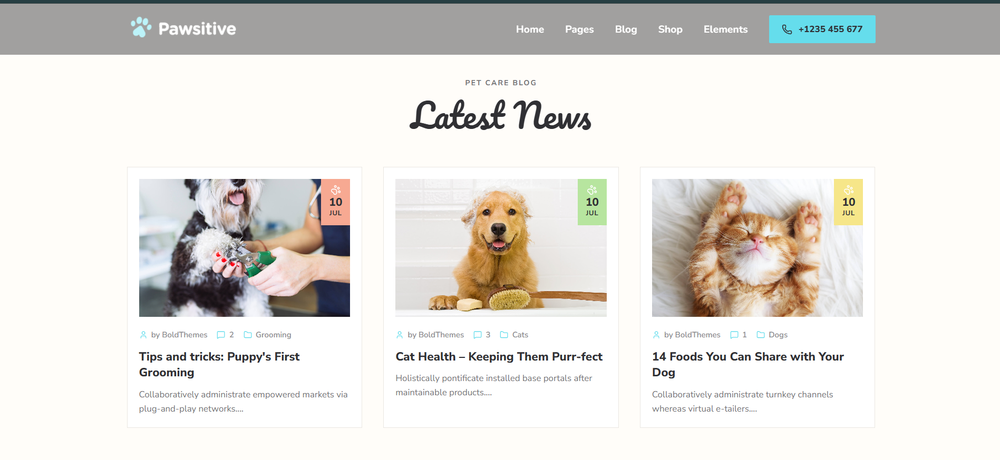

# 🐾 Pawsitive - Pet Care, Boarding & Spa Web Application

A modern, responsive pet care, luxury boarding, and spa retreat web application built with **React**, **Vite**, **Custom CSS**, and **Lucide Icons**.

---

## 📸 Screenshots

### 1. Hero & Navigation


### 2. Check-In & Service Highlights


### 3. What to Pack


### 4. Pet Boarding (Dog & Cat Kennels)



### 5. Pet Care Blog & Latest News


---

## 🎥 Video Explanation

Watch the full walkthrough and feature overview:

> 📹 **[Watch Video Walkthrough & Code Explanation](https://drive.google.com/file/d/17shWKZ4m3NhwgodOWs7KiyQTRTJzV4E9/view?usp=sharing)**  


## ✨ Features

- **Fixed Interactive Navigation**: Smooth scrolling, dropdown menus, and phone quick-call CTA.
- **Hero Section**: Fixed parallax background, script typography, and wave bottom border.
- **About & Service Cards**: Photo-backed service cards with interactive links.
- **Boarding Layouts**: Dedicated Dog Kennels & Cat Boarding sections with alternating layouts and animated decorative dots.
- **What to Pack**: 3-column layout highlighting essential packing tips with colored circle checkmark hover animations.
- **Pricing Packages**: 3-tier stay packages with custom SVG icons, Pacifico script pricing, and interactive purchase buttons.
- **Testimonials & Reviews**: Touch-enabled Swiper slider with custom quote hover effects and pill progress bars.
- **Pet Care Blog**: Framed blog cards with themed date ribbon badges and Lucide React metadata icons.
- **Animated Wave Footer**: Continuous wave contour with floating, bobbing keyframe animations and contact details.

---

## 🛠️ Tech Stack

- **Framework**: React 19
- **Build Tool**: Vite
- **Styling**: Custom CSS (CSS Custom Properties & Flexbox/Grid)
- **Icons**: Lucide React + Custom Inline SVGs
- **Fonts**: Pacifico & Nunito Sans (Google Fonts)

---

## 🚀 Getting Started

### 1. Prerequisites
- Node.js (v18 or higher recommended)
- npm or yarn

### 2. Installation
```bash
git clone https://github.com/prayash1322/pawsitive.git
cd pawsitive
npm install
```

### 3. Run Locally
```bash
npm run dev
```
Open your browser and navigate to `http://localhost:5173`.

### 4. Build for Production
```bash
npm run build
```

---

## 📁 Project Structure

```
pawsitive/
├── public/
├── src/
│   ├── assets/
│   │   └── images/
│   ├── components/
│   │   ├── layout/
│   │   │   ├── Header.jsx
│   │   │   └── Footer.jsx
│   │   ├── sections/
│   │   │   ├── Hero.jsx
│   │   │   ├── CheckInTime.jsx
│   │   │   ├── AboutUs.jsx
│   │   │   ├── CatBoarding.jsx
│   │   │   ├── DogKennels.jsx
│   │   │   ├── BoardingSection.jsx
│   │   │   ├── WhatToPack.jsx
│   │   │   ├── Pricing.jsx
│   │   │   ├── Testimonials.jsx
│   │   │   └── BlogPreview.jsx
│   │   └── ui/
│   │       ├── Button.jsx
│   │       ├── Card.jsx
│   │       └── SectionHeading.jsx
│   ├── styles/
│   │   ├── index.css
│   │   ├── components.css
│   │   └── main.css
│   ├── App.jsx
│   └── main.jsx
├── index.html
├── package.json
└── vite.config.js
```

---
