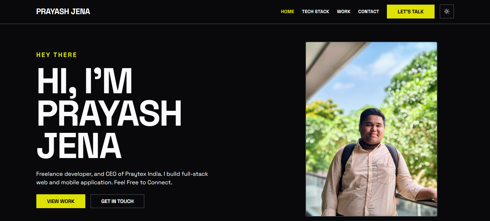
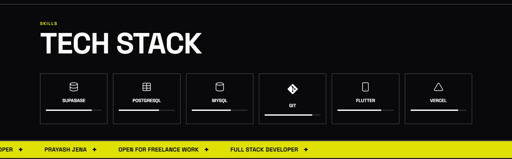
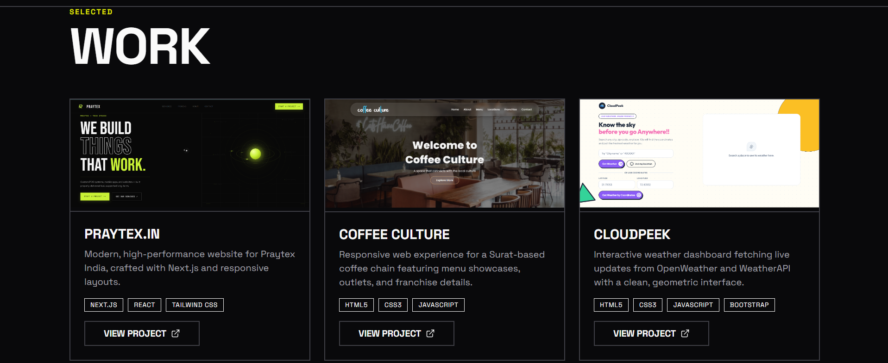
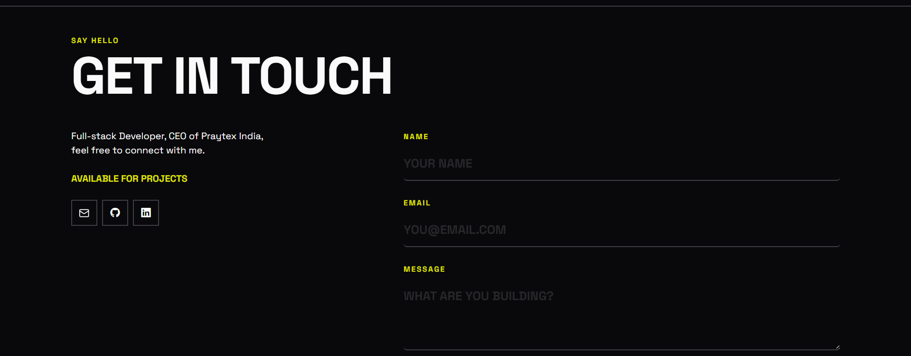

# Personal Portfolio Website

This is my personal portfolio website where I showcase my skills, the technologies I work with, and some of the projects I have created.

The website is built using React and Vite. I have focused on keeping the design clean, responsive, and easy to navigate.

---

## Screenshots

### 1. Hero and Navigation



### 2. Technology Stack



### 3. Projects



### 4. Contact Section



---

## Video Explanation

The video below includes a walkthrough of the website and a brief explanation of the project structure and code.

> **[Watch Video Walkthrough and Code Explanation](https://drive.google.com/file/d/1P0J_UYGjkJ0y85NtK2uEClI_3o0NL24R/view?usp=sharing)**

---

## Features

* Responsive navigation for moving between different sections of the website.
* A hero section that introduces me and my work.
* A section showing the technologies and tools I work with.
* A projects section where I have displayed some of my work.
* Project cards with information about each project.
* Reusable React components to keep the code organized.
* Responsive design that works on different screen sizes.
* Smooth scrolling between sections.
* Contact section for users to get in touch.
* Clean and simple user interface.

---

## Tech Stack

* **Framework:** React
* **Build Tool:** Vite
* **Styling:** Custom CSS
* **Language:** JavaScript
* **State Management:** React Context API

---

## Getting Started

### 1. Prerequisites

Before running the project, make sure you have the following installed:

* Node.js version 18 or higher
* npm or yarn

### 2. Installation

```bash
git clone https://github.com/YOUR_USERNAME/YOUR_REPOSITORY_NAME.git
cd portfolio
npm install
```

### 3. Run Locally

```bash
npm run dev
```

After running the command, open the local URL shown in your terminal, usually:

```text
http://localhost:5173
```

### 4. Build for Production

```bash
npm run build
```

---

## Project Structure

```text
portfolio/
├── public/
├── src/
│   ├── assets/
│   │   ├── images/
│   │   └── screenshots/
│   ├── components/
│   │   ├── common/
│   │   ├── Header.jsx
│   │   ├── Hero.jsx
│   │   ├── About.jsx
│   │   ├── TechStack.jsx
│   │   ├── Projects.jsx
│   │   ├── Contact.jsx
│   │   └── Footer.jsx
│   ├── context/
│   │   └── ThemeContext.jsx
│   ├── data/
│   │   ├── projects.js
│   │   └── technologies.js
│   ├── styles/
│   │   └── main.css
│   ├── App.jsx
│   └── main.jsx
├── index.html
├── package.json
└── vite.config.js
```

---
