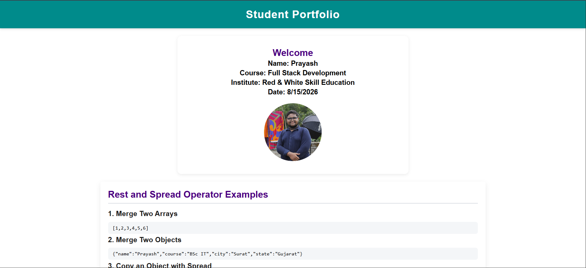
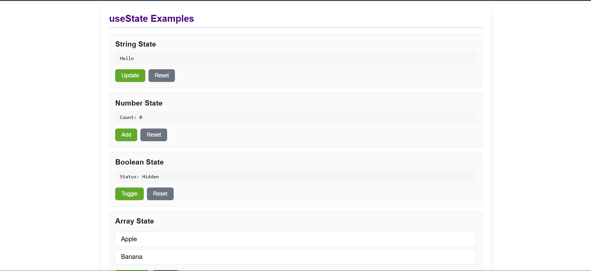
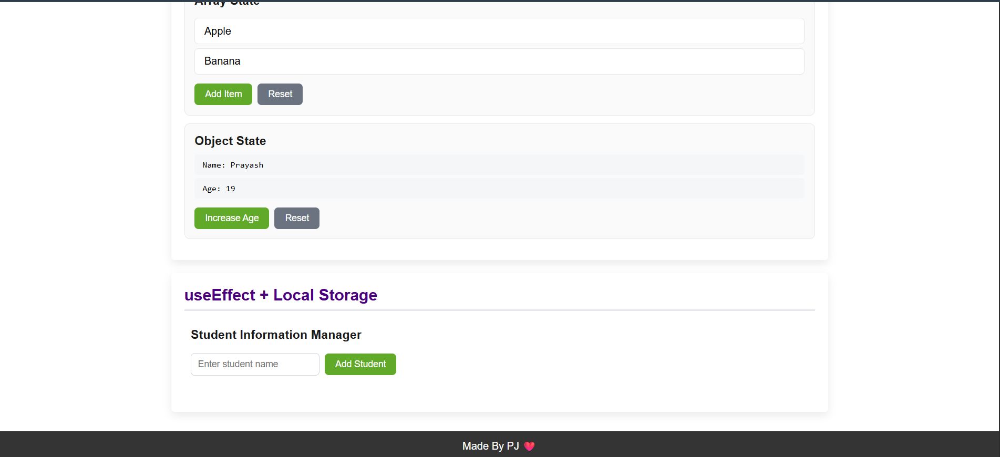
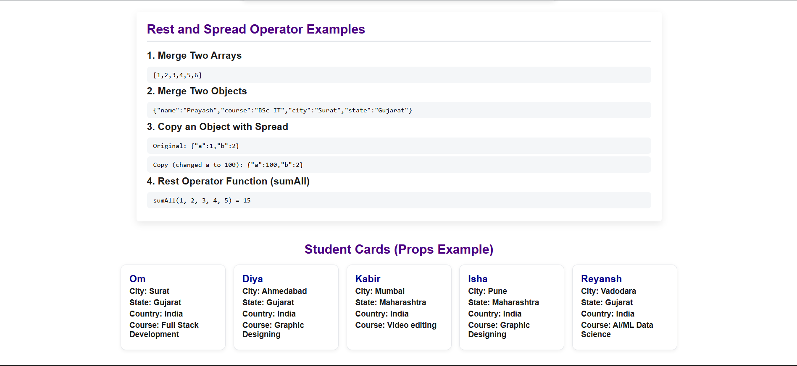

# Project-1 — React + Vite

A React learning project built during the **Full Stack Development** course at **Red & White Skill Education**. It covers core React concepts including components, props, state management with `useState`, side effects with `useEffect`, and local storage integration.

---

## Tech Stack

- React 19
- Vite 8
- JavaScript (JSX)
- CSS

---

## Features

- Welcome section with student info and profile image
- Rest & Spread operator demo
- Student card list rendered with props
- `useState` examples — String, Number, Boolean, Array, Object
- Student Manager with `useEffect` + Local Storage persistence

---

## Project Structure

```
project-1/
├── public/
├── src/
│   ├── assets/
│   │   └── me.JPG
│   ├── components/
│   │   ├── Header.jsx
│   │   ├── Footer.jsx
│   │   ├── WelcomeSection.jsx
│   │   ├── RestSpreadDemo.jsx
│   │   ├── StudentCard.jsx
│   │   ├── StudentCardList.jsx
│   │   ├── StateString.jsx
│   │   ├── StateNumber.jsx
│   │   ├── StateBoolean.jsx
│   │   ├── StateArray.jsx
│   │   ├── StateObject.jsx
│   │   └── StudentManager.jsx
│   ├── App.jsx
│   ├── main.jsx
│   └── index.css
├── package.json
└── vite.config.js
```

---

## Getting Started

```bash
# Install dependencies
npm install

# Start development server
npm run dev
```

App runs at `http://localhost:5173`

---

## Screenshots

> Add screenshots of your app here.

| Home Page | useState Demo |
|-----------|---------------|
|  |  |  |  

---

## Video Explanation

> Add a link to your video walkthrough here.

[](https://drive.google.com/file/d/1J4bmZVBlQBDMzU4LReXabVqNbKxhDDv1/view?usp=sharing)

---

## Author

**Prayash**
Course: Full Stack Development
Institute: Red & White Skill Education
